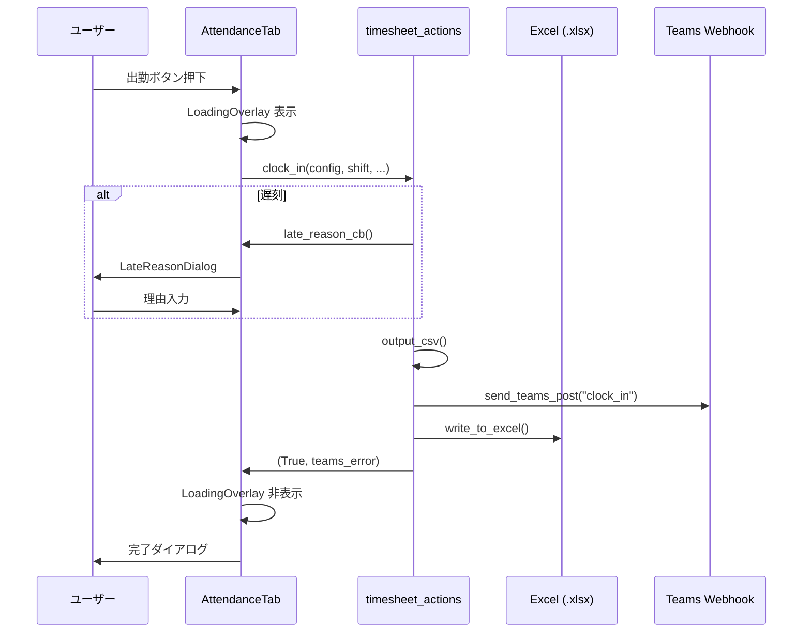
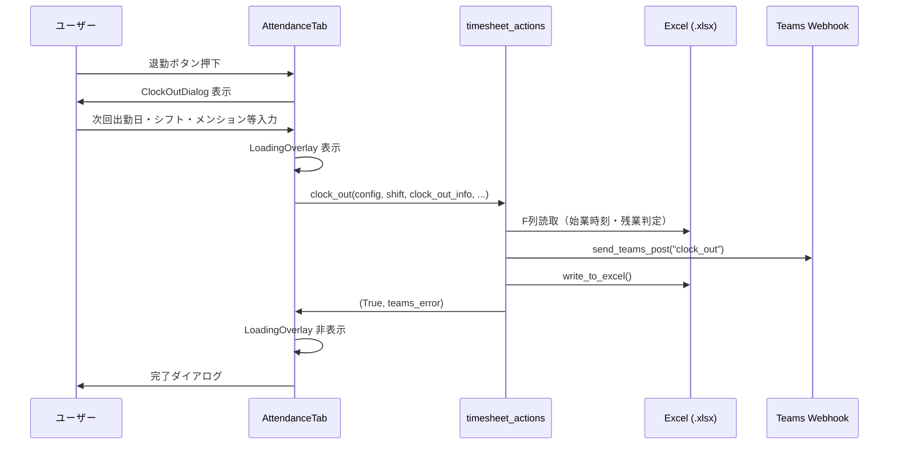

# 勤怠打刻アプリ 詳細設計書

- **バージョン**: v3.0.0
- **最終更新**: 2026-02-22

---

## 目次

1. [システム概要](#1-システム概要)
2. [動作環境・技術スタック](#2-動作環境技術スタック)
3. [プロジェクト構成](#3-プロジェクト構成)
4. [モジュール別仕様](#4-モジュール別仕様)
5. [機能仕様](#5-機能仕様)
6. [データフロー](#6-データフロー)
7. [設定ファイル仕様](#7-設定ファイル仕様-configssettingsjson)
8. [Excel 書込仕様](#8-excel-書込仕様)
9. [Teams Webhook 仕様](#9-teams-webhook-仕様)
10. [エラー一覧](#10-エラー一覧)
11. [ログ仕様](#11-ログ仕様)
12. [定数一覧](#12-定数一覧)

---

## 1. システム概要

### 目的

社員が日々の出退勤を記録するデスクトップアプリ。以下を自動化。

- タイムシート（`.xlsx`）への出退勤時刻書込
- CSV 出勤情報の出力
- Microsoft Teams への出退勤通知 Webhook 投稿
 
---

## 2. 動作環境

| 項目 | 内容 |
|---|---|
| 言語 | Python 3.10 以上 |
| GUI | PyQt5 >= 5.15 |
| Excel 読み書き | openpyxl >= 3.1 |
| HTTP | requests >= 2.31（未インストール時は urllib.request にフォールバック） |
| 設定ファイル | json（標準ライブラリ） |
| 日付・時刻 | datetime（標準ライブラリ） |
| ログ | logging + RotatingFileHandler（標準ライブラリ） |
| OS | Windows 10/11（タイトルバーテーマ機能は Windows のみ）・Linux |

### 起動方法

```bash
pip install -r requirements.txt
python kintai.py
```

---

## 3. プロジェクト構成

```
kintai-app-py/
├── kintai.py                        # エントリーポイント
├── requirements.txt
├── configs/
│   └── settings.json                # ユーザー設定ファイル
├── assets/
│   ├── __init__.py
│   ├── app_logger.py                # ログ設定
│   ├── config.py                    # settings.json 読み書きラッパー
│   ├── calendar_widget.py           # カスタムカレンダー Widget
│   ├── timesheet_constants.py       # 定数定義
│   ├── timesheet_helpers.py         # 時刻丸め・祝日計算・ファイル検索
│   ├── timesheet_actions.py         # 出退勤ロジック・Excel書込・CSV出力
│   ├── teams_webhook.py             # Teams Webhook POST
│   ├── theme_engine.py              # QSS テーマ生成・適用
│   ├── logs/
│   │   └── app.log                  # ローテーションログ（自動生成）
│   ├── images/
│   │   └── *.png                    # 退勤完了ダイアログ表示用画像
│   ├── dialogs/
│   │   ├── __init__.py
│   │   ├── clock_out_dialog.py      # 退勤情報入力ダイアログ
│   │   ├── late_reason_dialog.py    # 遅刻理由入力ダイアログ
│   │   ├── half_day_dialog.py       # 0.5日有給入力ダイアログ
│   │   └── remark_dialog.py        # 汎用備考入力ダイアログ
│   └── tabs/
│       ├── __init__.py
│       ├── attendance_tab.py        # 打刻タブ
│       ├── settings_tab.py          # 設定タブ
│       └── shift_type_tab.py        # 出勤形態タブ
└── attendance_data/                 # CSV 出力先（自動生成）
```

---

## 4. モジュール別仕様

### 4.1 `kintai.py` — エントリーポイント

#### クラス

| クラス | 内容 |
|---|---|
| `MainWindow` | QMainWindow サブクラス。QTabWidget に 3 タブを格納 |
| `MainWindow.apply_theme()` | テーマ適用。`_apply_titlebar_theme()` を内部から呼ぶ |

#### モジュールレベル関数

| 関数 | 内容 |
|---|---|
| `main()` | ログ初期化 → QApplication 起動 → Config ロード → テスト日付設定 → MainWindow 表示 |
| `_setup_font(app)` | 日本語フォント候補リストから利用可能なものを選択して設定（クラス外の関数） |
| `_apply_titlebar_theme(hwnd, theme)` | Windows DWM API でタイトルバー背景色を変更（Win32 のみ。クラス外の関数） |

---

### 4.2 `assets/app_logger.py` — ログ設定

| 関数 | 説明 |
|---|---|
| `setup_logging()` | `RotatingFileHandler` を root ロガーに登録。アプリ起動時に 1 回だけ呼ぶ。多重追加防止済み |
| `get_logger(name)` | モジュール別名前付きロガーを返す |

---

### 4.3 `assets/config.py` — 設定管理

#### `Config` クラス

| メソッド | 説明 |
|---|---|
| `__init__(data)` | dict から各フィールドを初期化。旧名称の出勤形態を新名称へマイグレーション（下表参照） |
| `Config.load(path)` | JSON ファイルから読込。ファイル不在・パースエラー時はデフォルト値で初期化 |
| `save(path)` | `to_dict()` の結果を JSON に保存。親ディレクトリが存在しない場合は自動作成 |
| `to_dict()` | 全フィールドを dict に変換して返す |

#### フィールド一覧

| フィールド | 型 | デフォルト | 説明 |
|---|---|---|---|
| `ad_name` | str | `""` | AD ユーザー名 |
| `display_name` | str | `""` | フルネーム（Teams 投稿の送信者名） |
| `teams_user_id` | str | `""` | 自分の Teams Principal ID |
| `shift_display_name` | str | `""` | シフト表上の名前表記 |
| `timesheet_display_name` | str | `""` | タイムシートファイル名に含まれる名前 |
| `webhook_url` | str | `""` | Teams Incoming Webhook URL |
| `timesheet_folder` | str | `""` | タイムシート .xlsx 格納フォルダ |
| `output_folder` | str | `"attendance_data"` | CSV 出力先フォルダ |
| `theme` | str | `"light"` | テーマキー（light / dark / green / sepia / high_contrast） |
| `shift_types` | List[str] | `[]` | 出勤コンボに表示するシフト名一覧 |
| `managers` | List[Dict] | `[]` | 管理職情報。`{"name": str, "teams_id": str}` の配列 |
| `proxy_sh` | str | `""` | プロキシ設定シェルスクリプトのパス |
| `test_date` | str | `""` | テスト用日付オーバーライド（`YYYY-MM-DD`）。空文字で無効 |

---

### 4.4 `assets/timesheet_constants.py` — 定数定義

アプリ全体で参照する定数をまとめたモジュール。
新しい出勤形態を追加する場合はここと `timesheet_actions.py` への追記が必要。

---

### 4.5 `assets/timesheet_helpers.py` — ユーティリティ

| 関数 | シグネチャ | 説明 |
|---|---|---|
| `get_now()` | `() -> datetime` | 現在日時を返す。`KINTAI_TEST_DATE` 環境変数が設定されている場合はその日付で返す |
| `get_today()` | `() -> date` | 今日の日付を返す。`KINTAI_TEST_DATE` 環境変数が設定されている場合はその日付で返す |
| `round_time()` | `(dt, unit=15) -> datetime` | 指定分単位で四捨五入する |
| `round_time_night_shift()` | `(dt, unit=15) -> dict` | 深夜勤務用丸め。22 時より前なら +24h して返す。`{"hours": int, "minutes": int}` |
| `time_to_excel_serial()` | `(hour, minute) -> float` | 時刻を Excel シリアル値（小数）に変換。例: 9:00 → 0.375 |
| `get_holidays()` | `(year, month) -> Set[date]` | 指定年月の日本の祝日集合を返す。振替休日も含む |
| `find_timesheet()` | `(folder, display_name, year, month) -> Optional[Path]` | フォルダ内から `{YYYYMM}{display_name}.xlsx` を検索して返す |
| `is_late()` | `(shift, now) -> bool` | 出勤形態と現在時刻を比較して遅刻かどうか判定。`LATE_MARGIN_MIN` 分超過で遅刻 |
| `format_date_jp()` | `(d) -> str` | `date` を `"2025年01月15日（火）"` 形式にフォーマット |
| `get_row_for_date()` | `(ws, target_day) -> Optional[int]` | C 列を走査して対象日の行番号を返す。29〜31 日は 28 日行の +offset で特定 |

#### テスト日付オーバーライドの仕組み

```
settings.json の test_date
        ↓ (kintai.py 起動時)
os.environ["KINTAI_TEST_DATE"] に設定（環境変数が既に設定済みの場合は上書きしない）
        ↓
get_now() / get_today() が参照
```

---

### 4.6 `assets/timesheet_actions.py` — 出退勤ロジック

#### 例外クラス

| 例外 | 発生条件 |
|---|---|
| `TimesheetNotFoundError` | タイムシート .xlsx が見つからない |
| `TimesheetLockedError` | ファイルが別プロセス（Excel 等）に開かれている |
| `TimesheetWriteError` | 行が見つからない・始業時間未記録・その他書込エラー |
| `UnknownShiftTypeError` | 処理が未定義の出勤形態が指定された |

#### 主要関数

| 関数 | 戻り値 | 説明 |
|---|---|---|
| `clock_in()` | `tuple[bool, str]` | 出勤処理。処理順: row_data 構築 → CSV 出力 → Teams 投稿 → Excel 書込。戻り値は `(成功フラグ, teams_error)` |
| `clock_out()` | `tuple[bool, str]` | 退勤処理。処理順: ターゲット日付決定 → 時刻丸め → 残業判定 → Teams 投稿 → Excel 書込。戻り値は `(成功フラグ, teams_error)` |
| `batch_write()` | `tuple[int, int]` | 複数日付の一括記入。日付ごとにループし書込失敗は個別スキップ。戻り値は `(成功件数, 失敗件数)` |
| `write_to_excel()` | `bool` | openpyxl で .xlsx に書込む。`get_row_for_date()` で対象行を特定し E/F/G/K/L 列に書込 |
| `output_csv()` | `None` | `{shift_display_name}.csv` を上書き出力（UTF-8 BOM なし）。詳細は下表参照 |
| `_find_xlsx_or_raise()` | `Path` | タイムシート検索。未設定・未検出は `TimesheetNotFoundError` を raise |

#### `output_csv()` 出力フォーマット

- ファイル名: `{shift_display_name}.csv`
- ヘッダ行: `name,shift`
- `name` 列: `shift_display_name`（設定値）
- `shift` 列: シフト名。リモート勤務の場合は末尾に `(ﾃ` を付与（例: `日勤(ﾃ`）。`ﾃ` は半角カタカナでテレワークの略

---

### 4.7 `assets/teams_webhook.py` — Teams 通知

| 関数 | 説明 |
|---|---|
| `send_teams_post()` | メッセージタイプに応じてペイロードを構築し POST する |
| `_build_clock_in_payload()` | 出勤用 Adaptive Cards ペイロード構築 |
| `_build_clock_out_payload()` | 退勤用 Adaptive Cards ペイロード構築。メンション解決も行う |
| `_build_column_obj()` | `"{名前}が{出勤/退勤}しました"` カラム部品を生成 |
| `_build_comment_obj()` | コメント TextBlock を生成。メンションの有無でスタイルが変わる |
| `_assemble_payload()` | column / message / comment を JSON 文字列として埋め込んだ最終ペイロードを組み立てる |
| `_post()` | requests（優先）または urllib で POST。HTTP 200/202 以外はエラー |
| `_get_proxies()` | `proxy.sh` を source して環境変数からプロキシ設定を取得 |
| `_save_debug_json()` | デバッグ用に `timesheet/teams_post_debug.json` へペイロードを保存 |
| `_format_date_short()` | `date` を `M/D(曜)` 形式（例: `2/21(土)`）にフォーマット |

---

### 4.8 `assets/tabs/attendance_tab.py` — 打刻タブ

#### `LoadingOverlay` クラス

処理中にメインウィンドウ全体を半透明（α=150）で暗くし「処理中...」を白字で表示する `QWidget` サブクラス。`QPainter` で直接描画するため子 Widget は持たない。`self.window()` を親として `resize` することでタブ内だけでなくメインウィンドウ全体をカバーする。

#### `AttendanceTab` クラス 主要メソッド

| メソッド | 説明 |
|---|---|
| `_on_shift_changed()` | シフト選択変更時にボタンラベル・有効状態・出勤形式 Radio の有効状態を更新。REALTIME_SHIFTS **かつ** 想定入力チェックあり **かつ** 一括リスト未選択の場合、退勤ボタンを無効化し出勤ボタンに `(想定)` を付与（例: `早番  出勤(想定)`） |
| `_show_loading()` / `_hide_loading()` | `LoadingOverlay` の表示・非表示。`processEvents()` で即時描画 |
| `on_clock_in()` | 出勤ボタン処理。コールバック定義 → `ta.clock_in()` 呼出 → 結果表示 |
| `on_clock_out()` | 退勤ボタン処理。`ClockOutDialog` 表示 → `ta.clock_out()` 呼出 → カスタム完了ダイアログ表示（退勤時刻・次回出勤・ランダム画像） |
| `on_batch_write()` | 一括記入ボタン処理。`ta.batch_write()` 呼出 → 結果サマリー表示 |
| `update_shift_types()` | 出勤形態コンボボックスを再構築（`ShiftTypeTab` から呼ばれる） |

> ⚠️ **未実装機能**: 「Timesheet Check」ボタンが UI 上に存在するが、現時点では「この機能は未実装です。」メッセージを表示するのみ。将来実装予定。

---

### 4.9 `assets/tabs/settings_tab.py` — 設定タブ

タブ最上部に **「設定を修正した場合は必ず下部にある保存ボタンを押して保存してください」** の注意書きラベル（赤字・太字）を表示する。

テーマ選択コンボは `_NoScrollComboBox`（`QComboBox` サブクラス）を使用しており、マウスホイールによる誤操作を防ぐためホイールイベントを無視する。

| メソッド | 説明 |
|---|---|
| `load_from_config()` | `Config` オブジェクトの値を各 Widget に反映する |
| `save_settings()` | 各 Widget の値を `Config` に書き戻し `configs/settings.json` に保存 |
| `_on_theme_changed()` | テーマ変更を即時反映（`MainWindow.apply_theme()` を呼ぶ） |

---

### 4.10 `assets/tabs/shift_type_tab.py` — 出勤形態タブ

| メソッド | 説明 |
|---|---|
| `add_shift()` | 新しい出勤形態を追加し `_sync()` を呼ぶ |
| `remove_shift()` | 選択中の出勤形態を削除し `_sync()` を呼ぶ |
| `_sync()` | `settings.json` に保存し `AttendanceTab` のコンボボックスを更新 |

> ⚠️ 新しい出勤形態を追加した場合、`timesheet_constants.py` と `timesheet_actions.py` への処理追記が必要。

---

### 4.11 `assets/dialogs/`

| ファイル | クラス | 主な入力項目 |
|---|---|---|
| `clock_out_dialog.py` | `ClockOutDialog` | 次回出勤日・次回シフト・次回勤務形態・メンション先・コメント・退勤タイプ（日跨ぎ）|
| `late_reason_dialog.py` | `LateReasonDialog` | 遅刻理由（テキスト） |
| `half_day_dialog.py` | `HalfDayDialog` | 始業時刻・終業時刻・備考 |
| `remark_dialog.py` | `RemarkDialog` | 備考（テキスト）|

#### `ClockOutDialog` 取得メソッド

| メソッド | 戻り値 | 説明 |
|---|---|---|
| `get_next_workday()` | `date` | 次回出勤日 |
| `get_next_shift()` | `str` | 次回シフト名 |
| `get_next_work_mode()` | `str` | `"リモート"` or `"出社"` |
| `get_mention()` | `str` | メンション先の名前。`"（なし）"` 選択時は空文字 |
| `get_comment()` | `str` | コメント。メンション指定あり＆コメント空の場合は `"-"` を補完 |
| `get_is_cross_day()` | `bool` | 日跨ぎ退勤かどうか |

---

## 5. 機能仕様

### 5.1 出勤処理

#### 出勤形態の分類

| 分類 | 種別 | 処理 |
|---|---|---|
| リアルタイム | 日勤 / 早番 / 遅番 / 深夜 | 実時刻使用。遅刻判定あり |
| 固定休暇 | シフト休 / 健康診断(半日) / 1日人間ドック / 慶弔休暇 | 定数から始終業時刻を取得 |
| 備考入力休暇 | 振休 / 1.0日有給 | ダイアログで備考を入力 |
| 半日有給 | 0.5日有給 | ダイアログで始終業時刻と備考を入力 |

#### 遅刻判定ロジック

```
現在時刻 > 定義始業時刻 + LATE_MARGIN_MIN(10分)  →  遅刻
```

- 深夜シフトは日付またぎを考慮した `datetime` 比較を行う
- 遅刻時は `LateReasonDialog` を表示し理由を入力させる
- E 列に `"遅刻"`、L 列に理由を記入

#### CSV 出力条件

- リアルタイムシフト **かつ** 想定記入でない **かつ** 本日の出勤

#### Teams 投稿条件

- リアルタイムシフト **かつ** 想定記入でない **かつ** 本日の出勤 **かつ** `TeamsPostなし` チェックなし

---

### 5.2 退勤処理

#### ターゲット日付の決定

| シフト | 日跨ぎ | ターゲット日付 |
|---|---|---|
| 通常シフト | 通常退勤 | 当日 |
| 通常シフト | 日跨ぎ退勤 | 前日 |
| 深夜シフト | 通常退勤 | 前日 |
| 深夜シフト | 日跨ぎ退勤 | 前々日 |

#### 終業時刻のシリアル値

| 条件 | 計算 | 例 |
|---|---|---|
| 通常シフト・通常退勤 | `round_time(now).hour` | `18:00` |
| 深夜（通常退勤）/ 通常シフト日跨ぎ | `round_time(now).hour + 24` | `25:00` |
| 深夜 **かつ** 日跨ぎ（翌々日退勤） | `round_time(now).hour + 48` | `49:00` |

#### 残業判定

始業シリアル値（F 列読み取り）と終業シリアル値の差が 9 時間超の場合、K 列に `"客先指示"` を記入。

#### Teams 投稿条件

- リアルタイムシフト **かつ** `TeamsPostなし` チェックなし

#### 退勤完了ダイアログ

`QMessageBox` ではなくカスタム `QDialog` を使用。

- **退勤時刻**: `round_time(get_now())` の結果を `YYYY/MM/DD HH:MM` 形式で表示
- **次回の出勤**: `ClockOutDialog` で入力した次回出勤日・シフト・勤務形態を `M/D(曜) シフト名勤務形態` 形式で表示
- **画像**: `assets/images/` 内の画像をランダムで1枚選択し、OKボタン左隣（75×75）に表示。画像が存在しない場合は画像なしで表示

---

### 5.3 一括記入

- 日付リストを `CalendarWidget` のダブルクリックまたは「追加」ボタンで蓄積
- 日付ごとにエラーが発生しても続行し、最後にサマリーを表示

#### UI 上の一括記入ボタン有効化条件

日付リストに1件以上 **かつ** 以下のシフトのいずれかが選択されていること:

- `REALTIME_SHIFTS`（日勤 / 早番 / 遅番 / 深夜）+ `想定入力` チェックあり
- `シフト休`
- `1.0日有給`

#### 日付リストに1件以上あるときの UI ロック挙動

| 対象 | 状態 |
|---|---|
| 想定入力チェック | 強制 ON でロック（変更不可） |
| TeamsPost なしチェック | ロック（変更不可） |
| 出勤・退勤ボタン | 無効化（出勤ボタンは「一括List選択中」と表示） |

#### バックエンド (`batch_write`) の対応シフト

`batch_write()` 自体は `VACATION_FIXED` 全般・`VACATION_INPUT`・`HALF_DAY_PAID`・`REALTIME_SHIFTS` すべてに対応している。ただし `0.5日有給` / `振休` 等は UI の `_BATCH_ALLOWED_SHIFTS` に含まれないため、現状 UI からは実行できない。

#### ダイアログ表示タイミング

`0.5日有給` / `VACATION_INPUT` は一括記入開始時に **最初の 1 回だけ** ダイアログを表示し、全日付に同じ値を適用する。

---

### 5.4 メンション機能（退勤時）

| 選択肢 | 動作 |
|---|---|
| `（なし）` | メンションなし |
| `@All管理職` | `config.managers` 全員の `teams_id` を `mention_data` に格納 |
| 個人名 | 一致する管理職の `teams_id` を `mention_data` に格納 |

- メンション指定あり＆コメント空の場合はコメントに `"-"` を自動補完

---

## 6. データフロー

### 6.1 出勤フロー



### 6.2 退勤フロー



---

## 7. 設定ファイル仕様 (`configs/settings.json`)

```json
{
  "ad_name": "yamada.taro",
  "display_name": "山田 太郎",
  "teams_user_id": "yamada@example.com",
  "shift_display_name": "山田",
  "timesheet_display_name": "山田",
  "webhook_url": "https://...",
  "timesheet_folder": "/path/to/timesheet",
  "output_folder": "attendance_data",
  "theme": "light",
  "shift_types": ["日勤", "早番", "遅番", "深夜", "シフト休", "振休", "1.0日有給", "0.5日有給"],
  "managers": [
    { "name": "鈴木部長", "teams_id": "suzuki@example.com" }
  ],
  "proxy_sh": "/path/to/proxy.sh",
  "test_date": ""
}
```

### `test_date` について

- `"YYYY-MM-DD"` 形式で設定すると、その日付でアプリが動作する（テスト用）
- 空文字で無効
- `KINTAI_TEST_DATE` 環境変数が既に設定されている場合は環境変数が優先される
- GUI からは設定不可（管理者が直接 JSON を編集する）

---

## 8. Excel 書込仕様

### タイムシートファイル検索

フォルダ内の `.xlsx` ファイルから以下を両方含むファイルを検索する。

- `{YYYY}{MM}` （例: `202602`）
- `timesheet_display_name` （例: `山田`）

→ 例: `202602山田.xlsx`

### 書込列

| 列 | Excel 列 | 内容 |
|---|---|---|
| E (5列目) | 就労テキスト | `"日勤"` / `"遅刻"` / `"シフト休"` 等 |
| F (6列目) | 始業時刻 | Excel シリアル値（小数） |
| G (7列目) | 終業時刻 | Excel シリアル値（小数）。24h 超えも可 |
| K (11列目) | 残業種別 | `"客先指示"` 等 |
| L (12列目) | 備考 | 遅刻理由・有給詳細・コメント 等 |

### 対象行の特定（`get_row_for_date`）

- C 列（3 列目）の 18〜48 行目を走査
- **1〜28 日**: C 列の数値と直接照合
- **29〜31 日**: 28 日の行番号 + offset（29→+1, 30→+2, 31→+3）
  - 29〜31 日の C 列は Excel 数式（`=IF(MONTH(...),29)` 等）のため数値照合不可

---

## 9. Teams Webhook 仕様

### ペイロード構造

Power Automate Workflow 向けの独自形式。`column` / `message` / `comment` は **JSON 文字列**として埋め込む（`ConvertTo-Json -Compress` 相当）。

```json
{
  "mention_data": ["suzuki@example.com"],
  "userId": "yamada@example.com",
  "column": "{...}",
  "message": "{...}",
  "comment": "{...}"
}
```

### メッセージ文言

| タイプ | 文言 |
|---|---|
| 出勤 | `業務を開始します。[日勤(リモート)]` |
| 退勤 | `退勤します。次回は 2/21(土) 日勤リモートです。`（シフト名が先、勤務形態が後） |

### デバッグ

送信前に `timesheet/teams_post_debug.json` へペイロードを保存する。

---

## 10. エラー一覧

| エラー | ダイアログタイトル | 原因 | 対処 |
|---|---|---|---|
| `TimesheetNotFoundError` | タイムシート未検出 | 指定フォルダに該当 .xlsx が存在しない | フォルダパス・ファイル名設定を確認 |
| `TimesheetLockedError` | ファイル書込エラー | .xlsx が Excel 等で開かれている | Excel を閉じてから再試行 |
| `TimesheetWriteError` (行未検出) | Excel書込エラー | 対象日の行が見つからない | タイムシートのレイアウトを確認 |
| `TimesheetWriteError` (始業未記録) | Excel書込エラー | 退勤時に F 列（始業）が空 | 先に出勤を記録する |
| `UnknownShiftTypeError` | 未定義の出勤形態 | 処理が定義されていないシフトが選択された | `timesheet_constants.py` / `timesheet_actions.py` に処理を追加 |
| Teams 投稿エラー | 完了ダイアログ内 ⚠ | Webhook URL 誤り・ネットワーク・プロキシ | URL・プロキシ設定を確認。`teams_post_debug.json` を参照 |

---

## 11. ログ仕様

### 出力先

```
assets/logs/app.log        # 現在のログ
assets/logs/app.log.1      # 1世代前
assets/logs/app.log.2      # 2世代前
assets/logs/app.log.3      # 3世代前
```

- 1 ファイル最大 **250KB**、最大 **3 世代**保存 → 合計最大 **1MB**

### フォーマット

```
2026-02-21 09:01:23 [INFO    ] kintai.actions: clock_in 開始: date=2026-02-21 shift=日勤 ...
```

### ロガー名とレベル

| ロガー名 | モジュール | 出力内容 |
|---|---|---|
| `kintai.main` | kintai.py | アプリ起動 |
| `kintai.actions` | timesheet_actions.py | 出退勤処理の開始・完了・エラー |
| `kintai.webhook` | teams_webhook.py | Teams POST の送信・成功・失敗 |

| レベル | 用途 |
|---|---|
| `INFO` | 出退勤・一括記入の開始/完了、Teams POST |
| `WARNING` | 想定内エラー（タイムシート未検出・ファイルロック等） |
| `ERROR` | 予期しない例外（スタックトレース付き） |
| `DEBUG` | Excel 書込詳細（ファイル名・行番号） |

---

## 12. 定数一覧

### シフト別開始・終了時刻

| シフト | 開始時刻 | 終了時刻 |
|---|---|---|
| 日勤 | 10:00 | 19:00 |
| 早番 | 07:00 | 16:00 |
| 遅番 | 14:30 | 23:30 |
| 深夜 | 22:30 | 31:30（翌7:30） |

### その他定数

| 定数 | 値 | 説明 |
|---|---|---|
| `LATE_MARGIN_MIN` | 10 | 遅刻と判定する許容分数 |
| `ROUND_UNIT_MIN` | 15 | 時刻丸め単位（分） |
| `WORK_STYLE_REMOTE` | `"リモート"` | 勤務形態：リモート |
| `WORK_STYLE_OFFICE` | `"出社"` | 勤務形態：出社 |

### 休暇種別の固定設定

| 出勤形態 | E 列（shift_label） | F 列（始業） | G 列（終業） | L 列（備考） |
|---|---|---|---|---|
| シフト休 | シフト休 | なし | なし | なし |
| 健康診断(半日) | 0.5日有給 | 14:00 | 18:00 | 午後健康診断+0.5有給 |
| 1日人間ドック | 日勤 | 10:00 | 18:00 | 1日人間ドック |
| 慶弔休暇 | 慶弔休暇 | なし | なし | なし |
| 振休 | シフト休 | なし | なし | ダイアログ入力値 |
| 1.0日有給 | 1.0日有給 | なし | なし | ダイアログ入力値 |
| 0.5日有給 | 0.5日有給 | ダイアログ入力値 | ダイアログ入力値 | ダイアログ入力値 |